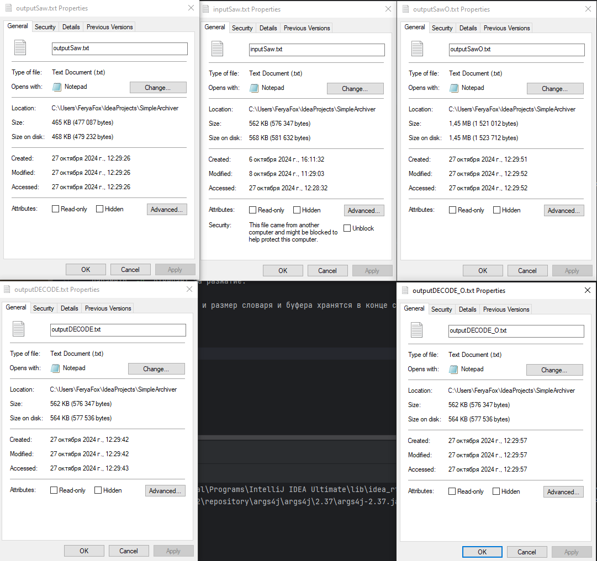
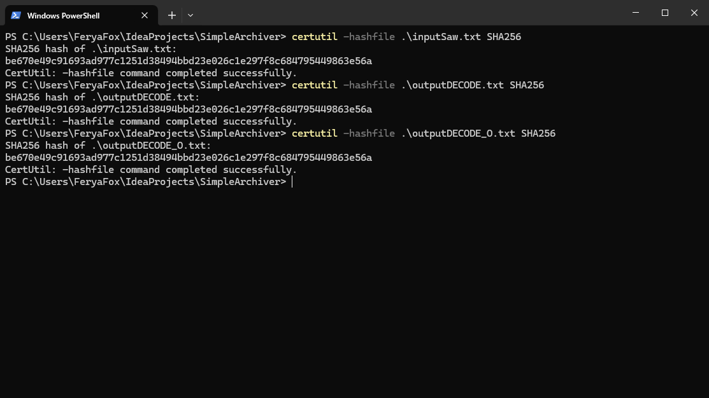

# FFZip

Достаточно простой архиватор написанный на java. Использует алгоритм Хаффмана и LZ77 для сжатия. 

## Сборка

```shell
mvn clean package
```

## Использование

### Сжатие

```shell
java -jar SimpleArchiver-1.2-jar-with-dependencies.jar -bs 256 -ds 1024 -c input.txt compress.txt
```

Параметр `-bs` отвечает за размер буфера для lz77. 
Параметр `-ds` за размер словаря lz77.
Параметр `-c` за то что, файл сжимается.

Есть необязательный параметр `-od` он отвечает за отключение оптимизации. И в этом случае ищется не самое лучшее вхождение в lz77, а самое первое.

### Разжатие

```shell
java -jar SimpleArchiver-1.2-jar-with-dependencies.jar -d compress.txt decompress.txt
```

Параметр `-d` отвечает за разжатие.

Вероятности для Хаффмана и размер словаря и буфера хранятся в конце сжатого файла.

## Пример работы



`inputSaw.txt` - входной файл.

`outputSaw.txt` - сжатый файл с включенной оптимизацией

`outputSawO.txt` - сжатый файл с выключенной оптимизацией

`outputDECODE.txt` - разжатый файл `outputSaw.txt`

`outputDECODE_O.txt` - разжатый файл `outputSawO`

### Хеш файлов


